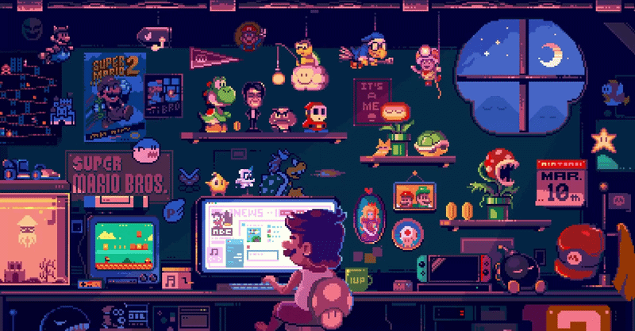


<base target="_blank">

<h1 align="center">Hi, I'm Khalil 👋</h1>

<h3 align="center">AI Engineer | Building Agents & data Pipelines</h3>

  I design AI agent systems that turn structured data into real, production-ready content —
  schema-driven pipelines, multilingual generation, and LLM orchestration.

    

 

  
  

  </a>
  
  

### 🌍 Languages

  <b>Arabic</b>: Native 🇲🇦 &nbsp; | &nbsp; <b>English</b>: C1 (EFSET) 🇺🇸 &nbsp; | &nbsp; <b>French</b>: B2 (DELF) 🇫🇷 &nbsp; | &nbsp; <b>Spanish</b>: A1 (Intermediate) 🇪🇸

---

# 🚀 Work

<table>
<td width="50%" valign="top">

**🧠 Multi-Agent Course Generation**

Designed and orchestrated a multi-agent AI for automated course generation, combining LLM orchestration, and web research to produce structured multi-day learning programs with up-to-date information. Implemented an LLM-as-a-Judge mechanism to evaluate task requirements and dynamically. Generated 6 hours of course content in less than 180 seconds.

`Python` `LangGraph` `Multi-Agent Systems` `LLM-as-a-Judge`
<a href="https://github.com/khalilghouddan/courseGenerationWithLangraphAndCrawl4ai" target="_blank" rel="noopener noreferrer" onclick="window.open(this.href, '_blank', 'noopener,noreferrer'); return false;">→ View repo</a>

</td>
<td width="50%" valign="top">

**🕸️ Web Scraping Pipeline**

Developed two independent, reusable web data services: a customized **SearXNG search engine** for web research and **Crawl4AI** for high-volume web crawling, scraping, and content extraction. Designed as shared services consumed by multiple AI projects to reduce reliance on paid search and scraping APIs and lower infrastructure costs. Achieved a **95% scraping success rate**.

`Python` `Crawl4AI` `SearXNG` `Web Scraping` `Search Engine` `Data Pipelines` `Microservices`

<a href="https://github.com/khalilghouddan/crawl4ai-project" target="_blank" rel="noopener noreferrer" onclick="window.open(this.href, '_blank', 'noopener,noreferrer'); return false;">→ View repo</a>

</td>
</tr>
<tr>
<td width="50%" valign="top">

**📈 Multi-Agent Market Intelligence**

A multi-agent system powered by the Google ADK that reads news sources and predicts market movement trends through structured analysis workflows.

`ADK` `Multi-Agent` `News Analysis` `Market Prediction`

<a href="https://github.com/khalilghouddan/Multi-Agent-Financial-Intelligence" target="_blank" rel="noopener noreferrer" onclick="window.open(this.href, '_blank', 'noopener,noreferrer'); return false;">→ View repo</a>

</td>
<td width="50%" valign="top">

**🤖 Internal RAG Chatbot**

Designed and integrated a retrieval-augmented chatbot into the **GLPI platform** to help employees and entrepreneurs answer internal questions using company knowledge and documentation. Built a RAG pipeline powered by **Qwen2.5** to retrieve relevant context and generate knowledge-grounded responses, achieving an average **question-response time of 1.8 seconds**.

 `Python` `Flask` `RAG` `Embeddings` `Vector Database` `GLPI` `Enterprise AI`

</td>
</tr>
</table>

---

### 📊 GitHub Activity

  <picture>
    <source media="(prefers-color-scheme: dark)" srcset="https://raw.githubusercontent.com/khalilghouddan/KhalilGhouddan/output/github-contribution-grid-snake-dark.svg">
    <source media="(prefers-color-scheme: light)" srcset="https://raw.githubusercontent.com/khalilghouddan/KhalilGhouddan/output/github-contribution-grid-snake.svg">
    
  </picture>

  
   
  Thanks for visiting! 💖

